# Simple QOL  
  
バニラのサバイバルをほんの少しだけ便利にします。     
対応バージョン: `v1.21.130`  

---

## 導入
ワールド設定の **実験的機能 > ベータAPI** を有効にしてください。   

---

## 内容

<strong>範囲攻撃</strong>

<h3 id="sweep_attack">■ 発動条件</h3>

- 剣を所持して振ったときに範囲攻撃が発動します。  
- 発動時、プレイヤーの視点方向にいるエンティティへ **1ダメージ（ハート0.5）** を与えます。  
> ダメージ増加が付与されている場合、**レベル × 1.25** のダメージが追加されます。  

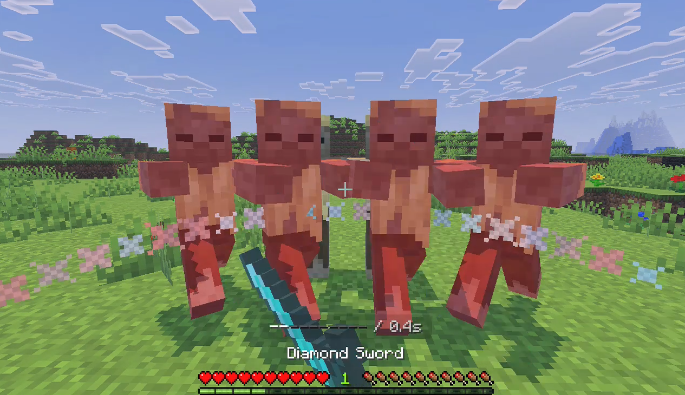

**発動には以下の条件をすべて満たす必要があります：**
> - 地面に立っている  
> - ダッシュ中ではない  
> - 攻撃チャージが最大まで溜まっている  

<h3>■ 攻撃チャージについて</h3>

- 範囲攻撃の後、**攻撃チャージが一時的に減少**します。  

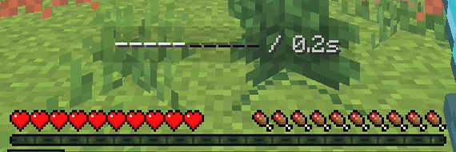

> チャージは **0.25秒後** に自動で回復します。  
> 再チャージ中に通常攻撃を行うと、攻撃チャージが減少し、範囲攻撃は発動しません。

---

<strong>一括破壊</strong>

### ■ 発動条件
- メインハンドにツルハシ、斧を持って鉱石、原木を破壊時に一括破壊が発動します。  

### ■ ON/OFF切り替え  
- メインハンドにツルハシ、斧を持ってスニークすることでON/OFFを切り替えることができます。
> ON/OFFを切り替えるには一括破壊が有効になっている必要があります。

**コマンド:**  
- `/mineall <true/false>` --- マインオールを有効/無効にする  
- `/cutall <true/false>` --- カットオールを有効/無効にする  

### ■ 設定フォーム
- メインハンドに斧、またはツルハシを持ってスニークしながら右クリックすることで設定フォームを表示できます。  
- 設定フォームでは最大連鎖回数、アイテムの静的ドロップ、アイテムの自動回収を設定できます。  

---

 

<strong>自動持ち替え</strong>

- ブロックを採掘時、インベントリ内に適正ツールがある場合自動で持ち替えをします。  

**コマンド:**  
- `/autotool <true/false>` --- 自動持ち替えを有効/無効にする

---

<strong>自動植え付け</strong>

- 作物にインタラクトした際に自動で回収・植え付けをします。  
> ※ 作物は最大レベルまで成長している必要があります。  

**コマンド:**  
- `/autofarm <true/false>` --- 自動植え付けを有効/無効にする  

---

<strong>アイテム・レベルの受け渡し</strong>

- アイテム、レベルを他プレイヤーに送信できます。

### ■ アイテム送信  
- メインハンドのアイテムを指定したプレイヤーに送信できます。  
> 送信先のプレイヤーのインベントリに空きがない場合は送信されません。  

**コマンド:**
- `/item <player>`

### ■ レベル送信
- 指定したレベルを指定したプレイヤーに送信できます。
> 最大レベル20000

**コマンド:**
- `/level <level> <player>`

---

<strong>ナビゲーション</strong>

- 指定したプレイヤー、死亡座標をナビゲーションすることができます。  
- アクションバーに **座標**、**距離**、**ディメンション**、**経過時間**(死亡座標の場合) の情報を表示します。  
- また、ナビゲーション先の方角を示すパーティクルを表示します。  
  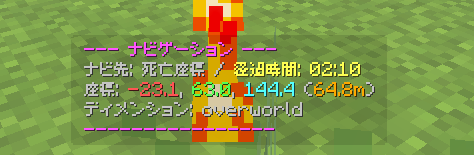  
  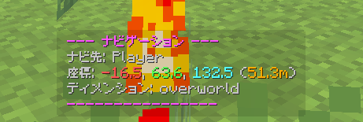  

**コマンド:**
- `/navigation player` --- プレイヤーをナビゲーションする
- `/navigation dead` --- 死亡座標をナビゲーションする
- `/navigation cancel` --- ナビゲーションを停止する

---

<strong>クイックドロップ</strong>

 
- トロッコ、ボートを殴った際に、**一撃でアイテム化**させます。  

**コマンド:**
- `/quickdrop <true/false>` --- クイックドロップを有効/無効にする  

---

<strong>ダイナミックライト</strong>

- メインハンドに松明を持った際に周囲を明るく照らします。  
  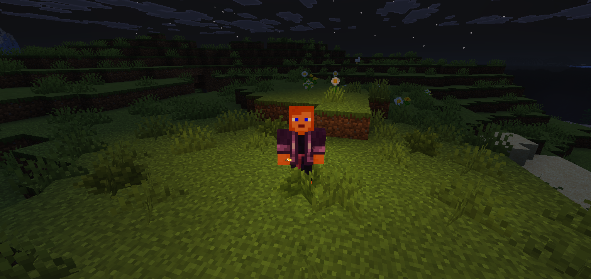  
  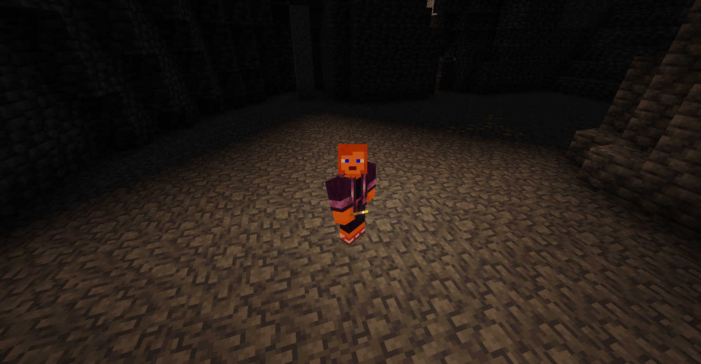  

**以下の条件では使用できません:**  
> - 水の中・溶岩の中  
> - 自身がブロックと重なっている  
> - 奈落  

**コマンド:**
- `/dynamiclight <true/false>` --- ダイナミックライトを有効/無効にする  

---

<strong>死亡座標の表示</strong>

- 死亡時に **死亡座標**, **ディメンション**, **時刻** を全体チャットに通知し、死亡情報を保存します。  
  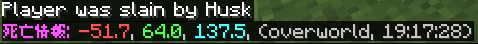  
- また過去10回件の死亡情報を表示できます。
  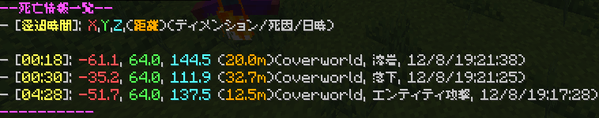  

**コマンド**
- `/dead` --- 死亡情報を表示する  
  
> 死亡情報: **死亡座標**, **死亡座標との距離**, **ディメンション**, **死因** **死亡時刻**, **経過時間**  
> 最大10件まで保存され、古い情報から順に削除されます。

---

<strong>体力表示</strong>

- ネームタグに現在体力・最大体力を表記します。  
  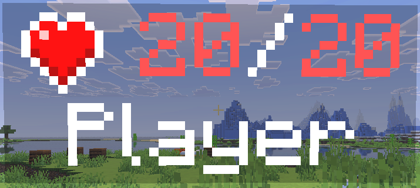  

---

<strong>チャンク表示</strong>

- チャンクの境界を表示します。  
  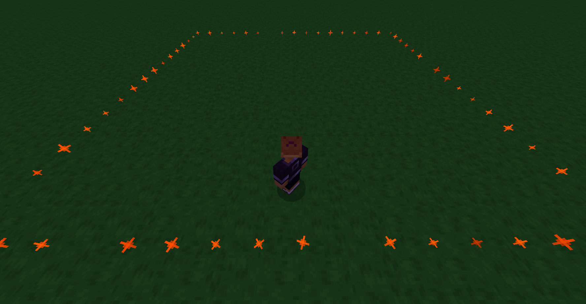  

**コマンド:**
- `/chunk <true/false>` --- チャンク表示を有効/無効にする  

---

<strong>アイテムの耐久値・満腹度の表示</strong>

- アイテムの説明欄に耐久値、満腹度、隠し満腹度の情報を記載します。  
  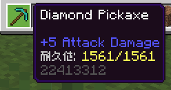  
  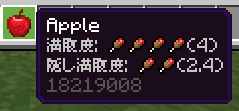  

---

<strong>椅子</strong>

- 何も持たずにスニークしながらブロックに向かってインタラクトすると、そのブロックに座れるようになります。  
  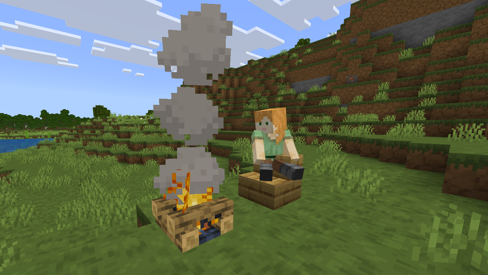  

---

<strong>プレイヤー乗車</strong>

- 他のプレイヤーの頭上に乗れるようになります。  
  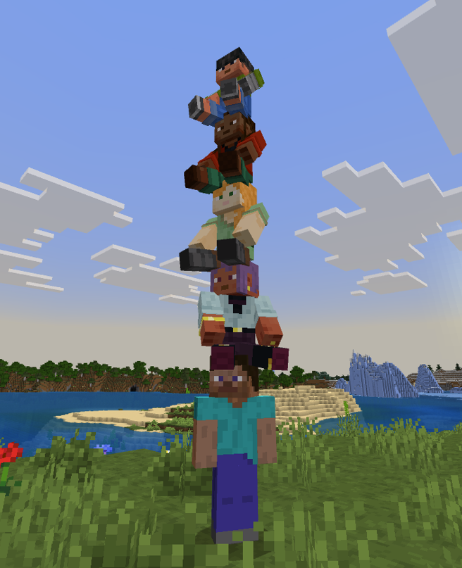  

---

<strong>馬の二人乗り</strong>

- 馬に **2人まで同時に乗車**できるようになります。   
  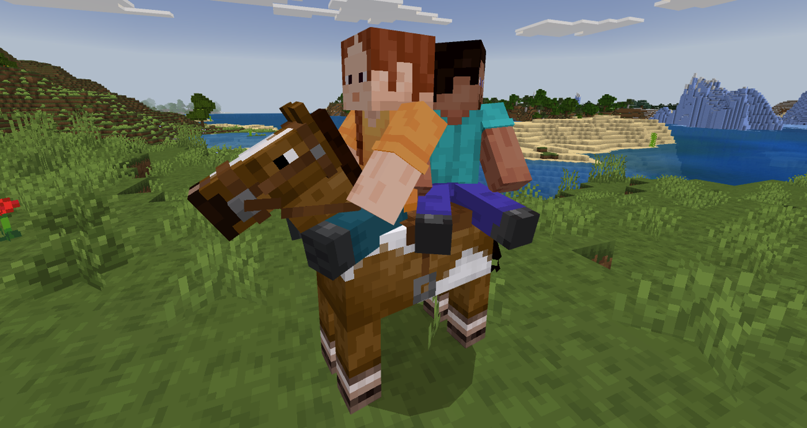
  
> ※ 二人乗りを行うには、**手懐けた馬**である必要があります。  
> （スケルトンホースを除く）  

**二人乗りができるエンティティ:**  
> - 馬  
> - ラバ
> - ロバ  
> - ゾンビホース
> - スケルトンホース

---

<strong>ハッピーガスト</strong>

- ハッピーガストの移動速度が **1.75倍** になり、よりスムーズに移動できるようになります。  
- また、雪玉以外のアイテムでもハッピーガストが近づくようになります。  

**対象外のアイテム：**
> - 剣、ツルハシ、斧、ショベル、桑、槍などの道具  
> - ヘルメット、チェストプレート、レギンス、ブーツなどの装備  

---

<strong>村人のインベントリ操作</strong>

- スニークしながら村人をインタラクトすると **村人フォーム** を開けます。  
  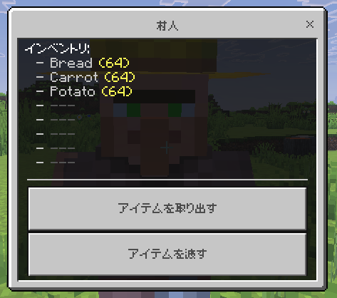  
- フォームでは所持アイテムの確認、下の二つのボタンから **アイテムの受け渡し** ができます。  

<strong>受け渡し可能なアイテム</strong>

 
> - パン  
> - じゃがいも  
> - にんじん  
> - ビートルート  
> - 小麦  
> - 小麦の種  
> - ビートルートの種  
> - トーチフラワーの種  
> - ウツボカズラ  
> - 骨粉

  

**コマンド:**
- `/vinv <true/false>` --- 村人のインベントリ操作を有効/無効にする  

---

<strong>プレイスコア</strong>

- ログイン回数、プレイ時間、ブロック設置数、死亡回数などをスコアに記録します。  

<strong>記録される項目</strong>

> - プレイ時間  
> - ログイン回数  
> - オンライン時間  
> - 最大オンライン時間  
> - ジャンプ回数  
> - スニーク回数  
> - 飛んだ距離(m)  
> - 泳いだ距離(m)  
> - 落ちた距離(m)  
> - 歩いた距離(m)  
> - 移動した距離(m)  
> - キル数  
> - モンスターキル数  
> - 動物キル数  
> - プレイヤーキル数  
> - 村人キル数  
> - ゾンビキル数  
> - スケルトンキル数  
> - クリーパーキル数  
> - ウィザーキル数  
> - エンダードラゴンキル数  
> - ウォーデンキル数  
> - 弓によるキル数  
> - 死亡回数  
> - 攻撃した回数   
> - 与えた総ダメージ  
> - 最大与ダメージ  
> - 受けたダメージ  
> - 弓を撃った回数  
> - ブロック設置数  
> - 種を植えた数  
> - ブロック破壊数  
> - 鉱石破壊数  
> - ダイヤ鉱石破壊数  
> - 古代の残骸破壊数  
> - 村人と話した回数    

**コマンド:**
- `/score` --- 自分のスコアを表示する  
- `/score <player>` --- 指定したプレイヤーのスコアを表示する  
- `/sidebar <id>` --- サイドバーにスコアを表示する  
- `/sidebar` --- サイドバーにスコアを非表示する  
- `/score_reset <player>` --- 指定したプレイヤーのスコアをリセットします(管理者用)  
- `/score_init` --- 全プレイヤーのスコアをリセットします(管理者用)  

---

<strong>難易度設定</strong>

- 難易度を設定できます。  

**コマンド:**
- `/dif <h/n/e/p>` --- 難易度を設定します。
- `/dif` --- 現在の難易度を表示します。

---

<strong>ログイン時の無敵時間</strong>

- ログイン/リスポーン時に **耐性Lv5** が付与され、リスキルを防止します。
> ログイン時: 30秒  
> リスポーン時: 10秒  

---

---

## 追加予定の機能
- バケツスタック  
- エンティティの体力表示  
